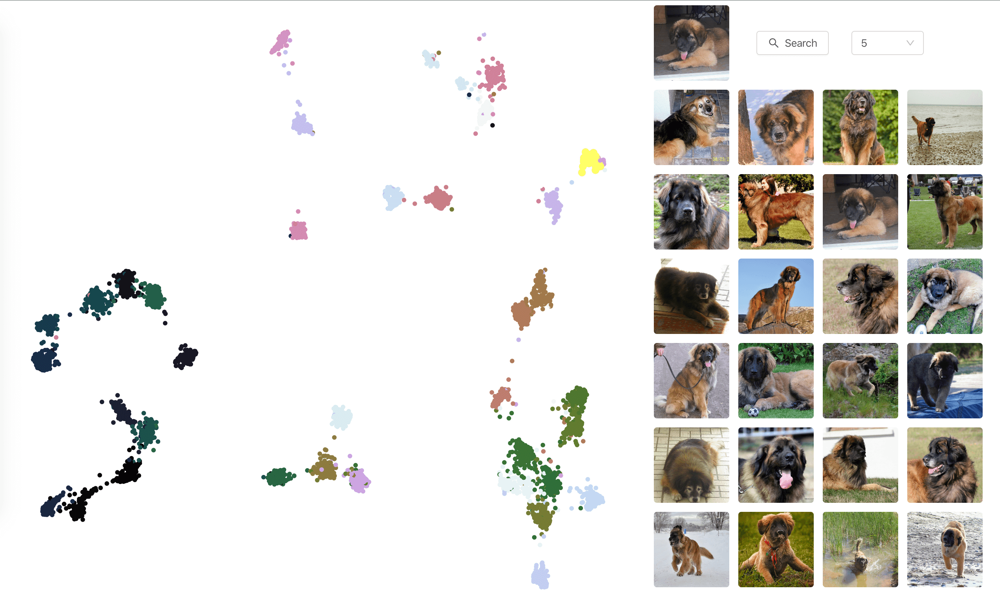

# iPet - Image Retrieval & Visualizatin System Based on Deep Learning

可怜无助又肥胖队，11号

#### Introduction

We design a web-based visualization system for image retrieval and exploration. The users can choose a query image, retrieve similar images from an extensive database in real-time. We use the pet dataset, and train image features using different neural networks such as ADSH(**reference from Asymmetric Deep Supervised Hashing, AAAI 2020**), VGG16, ResNet50, Inception_v3. Meanwhile, we evaluation the KNN map precision through our experiment.



#### Architecture

The file tree architecture is

```bash
.
├── assets
├── backend
│   ├── data
│   │   ├── hash_label
│   │   ├── inception_label
│   │   ├── resnet_label
│   │   ├── vgg_label
│   │   └── vgg_raw
│   └── src
├── deeplearning
│   ├── ADSH
│   │   ├── data
│   │   ├── log
│   │   └── utils
│   │       └── __pycache__
│   └── network_traninig_withlabel
├── frontend
│   └── src
└── image
    └── file
```

Our system is using libraries such as tensorflow, pytorch, react, flask, d3 and so on. The system code is in the `frontend` and `backend` folder. The deep learning training process is in `deeplearning` folder.

#### Dataset

we use [the pet database](https://www.kaggle.com/tanlikesmath/the-oxfordiiit-pet-dataset). 
1. If you want to train on your own, please add the data to the corresponding path and set the train and test folder on your own. Then you will get embedding.npz and 
2. If you want to run the visualization system, you should add all images to ./image folder
3. Through the modify of the backend/router.py line 11, you can change the specific feature 
#### Install library and run

We have provided the trained image feature saved in npz file. So you can enjoy the exploration.

```bash
# new terminal
cd backend
pip install -r requirements.txt
python router.py

# new terminal
cd frontend
npm install
npm run start

# new terminal
cd image
python -m http.server
```
then go to [localhost:8080](http://localhost:8080)


